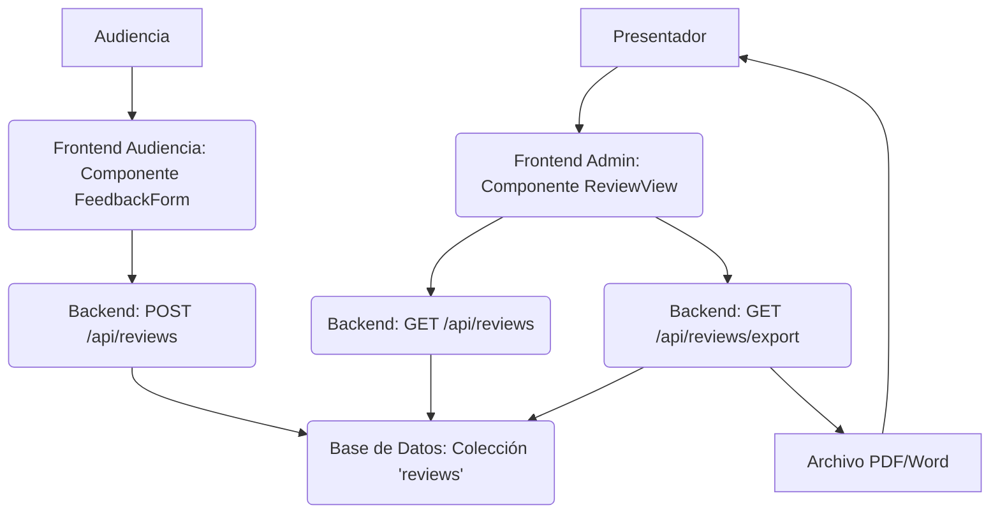

# Plan de Implementación: Módulo de Reseñas/Evaluación de Conferencia

Este documento detalla el plan para añadir un módulo de reseñas y evaluación a la aplicación, permitiendo a la audiencia proporcionar feedback sobre la conferencia y al presentador visualizar y exportar estos datos.

## 1. Objetivos

*   Permitir a la audiencia calificar la conferencia (ej. 1-10) y dejar comentarios.
*   Ofrecer la opción de enviar feedback de forma anónima o con el nombre registrado.
*   Almacenar de forma persistente las reseñas y calificaciones.
*   Permitir al presentador visualizar el feedback recibido.
*   Implementar una funcionalidad para exportar el feedback a formatos PDF y Word.

## 2. Análisis de Componentes Existentes

La aplicación ya cuenta con:
*   Sistema de Preguntas y Respuestas (`src/components/AudienceQA.tsx`, `src/store/audienceQAStore.ts`).
*   Sistema de Quiz/Preguntas de Opción Múltiple (`src/components/audience/QuestionInterface.tsx`).
*   Funcionalidad de Nube de Palabras (`src/components/wordcloud/WordCloudParticipant.tsx`, `src/store/wordCloudStore.ts`).
*   Manejo de participantes (`src/store/participantStore.ts`).
*   Posiblemente una base de datos (basado en `src/lib/mongodb.ts`).
*   Rutas API en el servidor (`server/`).

Este nuevo módulo se integrará con la estructura existente, utilizando la base de datos y añadiendo nuevas rutas API y componentes frontend.

## 3. Diseño de la Solución

### 3.1. Base de Datos

Se creará una nueva colección (ej. `reviews` o `feedback`) para almacenar las reseñas.
Campos propuestos:
*   `_id`: ID único de la reseña.
*   `eventId`: ID del evento/conferencia al que pertenece la reseña (para asociar feedback a eventos específicos).
*   `rating`: Calificación numérica (ej. 1-10).
*   `comment`: Texto del comentario/opinión.
*   `authorId`: ID del participante si no es anónimo (opcional, referencia a la colección de participantes).
*   `isAnonymous`: Booleano para indicar si la reseña es anónima.
*   `createdAt`: Marca de tiempo de la creación de la reseña.

### 3.2. Backend (Server)

Se añadirán nuevas rutas API en `server/` (ej. en un nuevo archivo `server/review-routes.js` o integradas en uno existente si aplica):
*   `POST /api/reviews`: Recibe los datos de la reseña (rating, comment, authorId si no es anónimo, isAnonymous, eventId) y los guarda en la base de datos.
*   `GET /api/reviews?eventId=<id>`: Recupera todas las reseñas asociadas a un `eventId` específico. Esta ruta será utilizada por el panel de administración.
*   `GET /api/reviews/export?eventId=<id>&format=<pdf|word>`: Recupera las reseñas para el `eventId` dado, genera el documento en el formato especificado (PDF o Word) y lo envía como respuesta.

### 3.3. Frontend (Audiencia)

*   **Componente `FeedbackForm.tsx`:** Se creará un nuevo componente React en `src/components/audience/` (o similar).
    *   Incluirá un control para seleccionar la calificación (ej. slider, radio buttons).
    *   Un área de texto (`textarea`) para el comentario.
    *   Un checkbox "Enviar de forma anónima".
    *   Un botón de "Enviar Reseña".
    *   Utilizará el store de participantes (`useParticipantStore`) para obtener el ID del usuario si no es anónimo.
    *   Manejará el estado local del formulario y la llamada a la API `POST /api/reviews`.
*   **Integración en `AudienceView.tsx`:** Se decidirá cuándo y dónde mostrar este formulario a la audiencia (ej. al finalizar el evento, en una pestaña dedicada).

### 3.4. Frontend (Administrador/Presentador)

*   **Store `reviewStore.ts`:** Se creará un nuevo store Zustand en `src/store/` para manejar el estado del feedback en el panel de administración (lista de reseñas, estado de carga, errores).
*   **Componente `ReviewView.tsx`:** Se creará un nuevo componente React en `src/components/admin/` (o similar).
    *   Recuperará las reseñas usando el `reviewStore` y la ruta `GET /api/reviews`.
    *   Mostrará las reseñas en una lista, incluyendo calificación, comentario y autor (indicando si es anónimo).
    *   Incluirá un botón "Exportar Feedback".
    *   El botón de exportar llamará a la ruta `GET /api/reviews/export`, manejando la descarga del archivo.
*   **Integración en `AdminDashboard.tsx`:** Se añadirá una nueva sección o pestaña en el dashboard de administración para mostrar el `ReviewView`.

### 3.5. Exportación (Backend)

*   Se investigarán y utilizarán librerías Node.js para la generación de documentos (ej. `pdfmake` para PDF, `docx` para Word).
*   La ruta `GET /api/reviews/export` formateará los datos de las reseñas y utilizará la librería seleccionada para crear el archivo.
*   El archivo generado se enviará al cliente con los headers HTTP adecuados para forzar la descarga.

## 4. Diagrama de Flujo (Simplificado)

## 5. Pasos de Implementación (Orden Propuesto)

1.  Definir el esquema de la colección `reviews` en la base de datos.
2.  Implementar la ruta API `POST /api/reviews` en el backend.
3.  Crear el componente `FeedbackForm.tsx` en el frontend de audiencia.
4.  Integrar `FeedbackForm.tsx` en `AudienceView.tsx`.
5.  Crear el store `reviewStore.ts` en el frontend.
6.  Implementar la ruta API `GET /api/reviews` en el backend.
7.  Crear el componente `ReviewView.tsx` en el frontend de administración.
8.  Integrar `ReviewView.tsx` en `AdminDashboard.tsx`.
9.  Investigar y seleccionar librerías de exportación (PDF/Word) para Node.js.
10. Implementar la ruta API `GET /api/reviews/export` en el backend.
11. Añadir la funcionalidad de exportación en el componente `ReviewView.tsx`.
12. Realizar pruebas exhaustivas de todas las funcionalidades.

## 6. Próximos Pasos

Una vez revisado y aprobado este plan, se procederá a la implementación de cada uno de los pasos detallados.