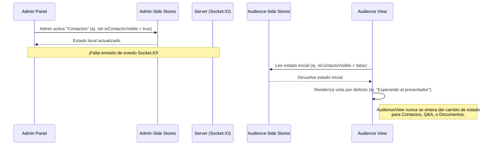
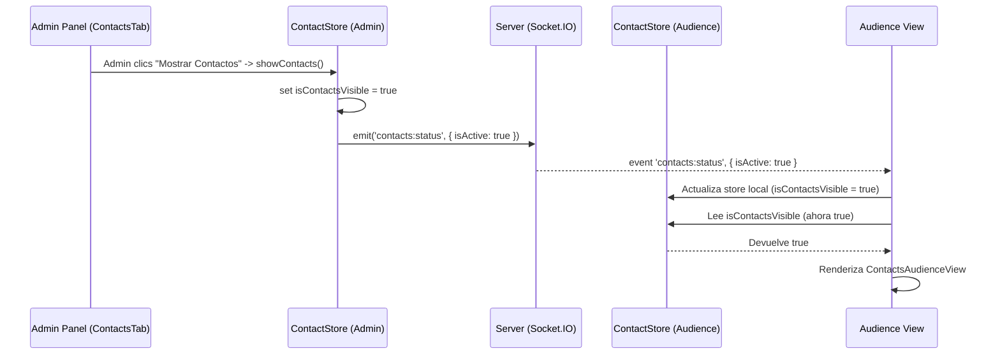

# Plan de Acción: Corrección de Fallas en Interacción Presentador-Audiencia

## 1. Reporte de Fallas y Diagnóstico

La falla principal es que la "Vista de la Audiencia" ([`src/pages/AudienceView.tsx`](src/pages/AudienceView.tsx:1)) no actualiza su contenido dinámicamente para las secciones de Nube de Palabras (parcialmente funcional), Contactos, Preguntas de la Audiencia (Q&A) y Documentos. Esto se debe a una combinación de estados de activación faltantes o no comunicados y lógica de renderizado incompleta en `AudienceView.tsx`.

**Diagnóstico Detallado por Funcionalidad:**

*   **Nube de Palabras (`WordCloud`):**
    *   **Estado:** `useWordCloudStore` tiene `isActive`.
    *   **Comunicación:** `AudienceView.tsx` escucha el evento socket `wordcloud:status` para actualizar `isActive`.
    *   **Renderizado en `AudienceView.tsx`:** Sí, condicionado por `isWordCloudActive`.
    *   **Estado Actual:** Debería funcionar si el administrador activa correctamente la nube de palabras y el evento `wordcloud:status` se emite/recibe.

*   **Contactos (`Contacts`):**
    *   **Estado:** `useContactStore` tiene `isContactsVisible`.
    *   **Comunicación:** `ContactsTab.tsx` (admin) llama a `showContacts()` en el store, cambiando `isContactsVisible` a `true` **localmente en el store del administrador**. **No se emite ningún evento de Socket.IO** para notificar a la audiencia.
    *   **Renderizado en `AudienceView.tsx`:** **No utiliza** el estado `isContactsVisible` para mostrar [`src/components/contacts/ContactsAudienceView.tsx`](src/components/contacts/ContactsAudienceView.tsx:1).
    *   **Conclusión:** Falla. La `AudienceView` no sabe cuándo mostrar los contactos.

*   **Preguntas de la Audiencia (`Audience Q&A`):**
    *   **Estado:** `useAudienceQAStore` **no tiene** un estado booleano como `isAudienceQAActive` para controlar si la audiencia debe ver la interfaz para enviar preguntas.
    *   **Comunicación:** No hay un mecanismo para que el administrador "active" esta vista para la audiencia. El componente [`src/components/AudienceQA.tsx`](src/components/AudienceQA.tsx:1) (usado en el admin) gestiona las preguntas pero no emite una señal de "activación".
    *   **Renderizado en `AudienceView.tsx`:** No hay lógica para mostrar condicionalmente `<AudienceQA isAdmin={false} />` basado en una acción del presentador.
    *   **Conclusión:** Falla. La `AudienceView` no sabe cuándo permitir que la audiencia envíe preguntas.

*   **Documentos (`Documents`):**
    *   **Estado:** El componente [`src/components/admin/DocumentSharingTab.tsx`](src/components/admin/DocumentSharingTab.tsx:1) gestiona la subida y lista de documentos pero **no utiliza un store de Zustand para un estado de visibilidad/actividad** para la audiencia.
    *   **Comunicación:** **No se emite ningún evento de Socket.IO** para notificar a la audiencia que los documentos están disponibles o actualizados.
    *   **Renderizado en `AudienceView.tsx`:** Aunque se importa [`src/components/DocumentDownloadList.tsx`](src/components/DocumentDownloadList.tsx:1), **no hay lógica para renderizarlo** condicionalmente.
    *   **Conclusión:** Falla. La `AudienceView` no sabe cuándo mostrar la lista de documentos.

**Diagrama Conceptual de la Falla (Ejemplo para Contactos):**


## 2. Plan de Acción Propuesto

**Objetivo General:** Implementar un sistema robusto para que el presentador pueda activar/desactivar diferentes vistas interactivas (Nube de Palabras, Contactos, Q&A, Documentos) y que la `AudienceView` reaccione correctamente a estos cambios.

### Fase 1: Estandarización del Manejo de Estado de Actividad

Para cada funcionalidad interactiva:

1.  **Asegurar Estado de Activación en Stores:**
    *   **`useContactStore`**:
        *   Considerar renombrar `isContactsVisible` a `isContactsActive` por consistencia.
    *   **`useAudienceQAStore`**:
        *   **Acción:** Añadir estado: `isAudienceQAActive: boolean` (default: `false`).
        *   **Acción:** Añadir funciones `activateAudienceQA()` y `deactivateAudienceQA()`.
    *   **`useWordCloudStore`**: Ya tiene `isActive`. Revisar si la activación desde el admin funciona correctamente.
    *   **Documentos:**
        *   **Acción:** Crear nuevo store: `src/store/documentSharingStore.ts`.
        *   **Contenido del Store:**
            *   `isDocumentsActive: boolean` (default: `false`).
            *   `documents: IDocument[]`.
            *   Funciones: `activateDocumentsView()`, `deactivateDocumentsView()`, `loadDocuments()`, `addDocument()`, `deleteDocument()`.
            *   Lógica Socket.IO para recibir `documents:list_update`.

### Fase 2: Comunicación de Cambios de Estado (Admin -> Audiencia vía Socket.IO)

1.  **Definir/Confirmar Eventos de Socket.IO:**
    *   `contacts:status` (payload: `{ isActive: boolean }`)
    *   `audienceQA:status` (payload: `{ isActive: boolean }`)
    *   `documents:status` (payload: `{ isActive: boolean }`)
    *   `documents:list_update` (payload: `IDocument[]`)
    *   `wordcloud:status` (payload: `{ isActive: boolean }`) - Ya existe, verificar su correcta emisión desde el admin.

2.  **Modificar Pestañas del Panel de Administración:**
    *   **`ContactsTab.tsx` ([`src/components/contacts/ContactsTab.tsx`](src/components/contacts/ContactsTab.tsx:1)):**
        *   **Acción:** Al llamar a `showContacts()` (y crear/llamar a `hideContacts()`), además de actualizar el store, emitir `socket.emit('contacts:status', { isActive: true/false })`.
    *   **`AdminDashboard.tsx` ([`src/pages/AdminDashboard.tsx`](src/pages/AdminDashboard.tsx:1)) (para la pestaña AudienceQA):**
        *   **Acción:** Cuando se selecciona/deselecciona la pestaña "AudienceQA", llamar a `activateAudienceQA()` / `deactivateAudienceQA()` en `useAudienceQAStore`.
        *   **Acción:** Estas funciones en el store deben emitir `socket.emit('audienceQA:status', { isActive: true/false })`.
    *   **`WordCloudTab.tsx` ([`src/components/wordcloud/WordCloudTab.tsx`](src/components/wordcloud/WordCloudTab.tsx:1)):**
        *   **Acción:** Verificar que al activar/desactivar la nube de palabras, se emita correctamente `socket.emit('wordcloud:status', { isActive: true/false })`.
    *   **`DocumentSharingTab.tsx` ([`src/components/admin/DocumentSharingTab.tsx`](src/components/admin/DocumentSharingTab.tsx:1)):**
        *   **Acción:** Refactorizar para usar `useDocumentSharingStore`.
        *   **Acción:** Añadir botones "Mostrar en Audiencia" / "Ocultar de Audiencia".
        *   **Acción:** Al hacer clic, llamar a `activateDocumentsView()` / `deactivateDocumentsView()` en el store, que emitirán `socket.emit('documents:status', { isActive: true/false })`.
        *   **Acción:** Al subir/eliminar un documento, el store emitirá `socket.emit('documents:list_update', newDocumentList)`.

3.  **Modificar `server/index.js` (o el manejador de sockets):**
    *   **Acción:** Asegurar que el servidor retransmita los eventos (`contacts:status`, `audienceQA:status`, `documents:status`, `documents:list_update`, `wordcloud:status`) a todos los clientes de la audiencia.

### Fase 3: Actualizar `AudienceView.tsx` para Reaccionar a los Cambios

1.  **Suscripción a Nuevos Estados y Eventos:**
    *   **Acción:** Obtener los estados de los stores: `isContactsActive`, `isAudienceQAActive`, `isDocumentsActive`.
    *   **Acción:** En el `useEffect` de Socket.IO:
        *   Escuchar `contacts:status` y actualizar `useContactStore.setState({ isContactsVisible: data.isActive })`.
        *   Escuchar `audienceQA:status` y actualizar `useAudienceQAStore.setState({ isAudienceQAActive: data.isActive })`.
        *   Escuchar `documents:status` y actualizar `useDocumentSharingStore.setState({ isDocumentsActive: data.isActive })`.
        *   Escuchar `documents:list_update` y actualizar `useDocumentSharingStore.setState({ documents: data })`.

2.  **Lógica de Renderizado Condicional Mejorada:**
    *   **Acción:** Modificar la sección de renderizado principal para mostrar exclusivamente una vista interactiva o la pregunta del quiz.
        ```javascript
        // En AudienceView.tsx
        // ...
        // if (isTournamentActive) return <TournamentAudienceView />;
        // if (isWordCloudActive) return <WordCloudParticipant />;
        // if (isContactsActive) return <ContactsAudienceView />;
        // if (isAudienceQAActive) return <AudienceQA isAdmin={false} />;
        // if (isDocumentsActive) return <DocumentDownloadList />;
        // if (currentQuestion) return <InterfazDeVotacion ... />;
        // return <PantallaDeEspera ... />;
        ```
    *   **Consideración UX:** Definir prioridades si múltiples estados `isActive` pudieran ser `true` simultáneamente, o si la pregunta del quiz debe tener prioridad.

### Fase 4: Pruebas y Refinamiento

*   Probar cada flujo de activación/desactivación.
*   Verificar la correcta interacción dentro de cada vista activada.

**Diagrama Conceptual de la Solución (Ejemplo para Contactos):**


Este plan debería abordar las fallas identificadas y mejorar significativamente la interactividad de la aplicación.