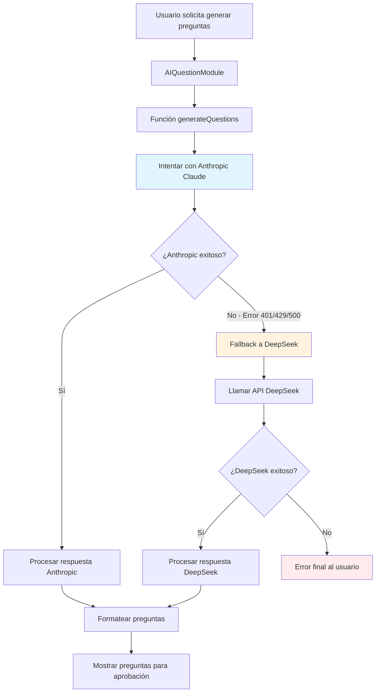
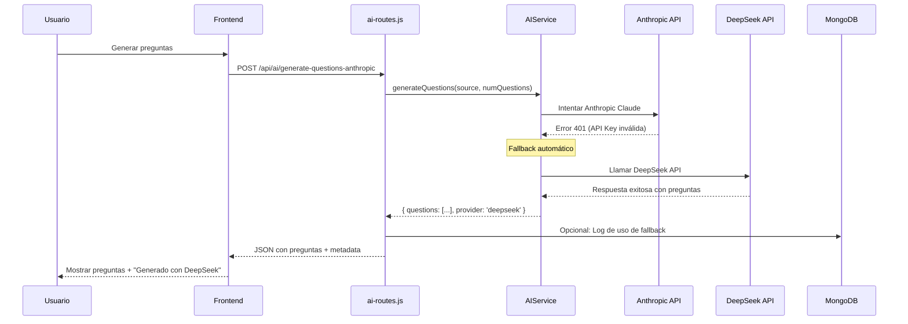

# 🚀 Plan: Sistema de Fallback IA con DeepSeek

## 📋 Resumen Ejecutivo

Este documento detalla el plan para resolver el error 401 del módulo de generación de preguntas con IA (Anthropic) e implementar un sistema de fallback automático usando DeepSeek como respaldo.

## 🔍 Análisis del Problema Actual

### Situación Identificada
- **Módulo afectado**: `AIQuestionModule` que usa Anthropic Claude
- **Error**: HTTP 401 (Unauthorized) al llamar a `/api/ai/generate-questions-anthropic`
- **Causa probable**: Clave de Anthropic inválida, expirada o con límites excedidos
- **Impacto**: Los usuarios no pueden generar preguntas con IA desde documentos o texto

### Arquitectura Actual
```
Frontend (AIQuestionModule) 
    ↓
/api/ai/generate-questions-anthropic 
    ↓
server/ai-routes.js 
    ↓
Anthropic Claude API (FALLA 401)
```

## 🎯 Objetivos del Plan

1. ✅ **Resolver el error 401** implementando un sistema de fallback robusto
2. ✅ **Investigar y usar el mejor modelo DeepSeek** para generación de preguntas
3. ✅ **Mantener compatibilidad** con el formato actual de preguntas
4. ✅ **Mejorar la robustez** del sistema con logging y monitoreo
5. ✅ **Experiencia de usuario sin interrupciones** cuando falle un proveedor

## 🏗️ Arquitectura de la Solución



## 📊 Investigación de Modelos DeepSeek

### Modelo Recomendado: `deepseek-chat`

**¿Por qué deepseek-chat?**
- ✅ **Modelo más avanzado** de DeepSeek para tareas generales
- ✅ **Excelente para razonamiento** y generación de contenido educativo
- ✅ **Mejor balance costo/rendimiento** comparado con Anthropic
- ✅ **Soporte nativo para español** y múltiples idiomas
- ✅ **API compatible** con formato OpenAI (fácil integración)

### Especificaciones Técnicas
```json
{
  "modelo": "deepseek-chat",
  "endpoint": "https://api.deepseek.com/v1/chat/completions",
  "max_tokens": 4000,
  "temperature": 0.7,
  "costo_aproximado": "$0.14 por 1M tokens (vs $3.00 Anthropic)"
}
```

## 🔧 Implementación Técnica Detallada

### Fase 1: Configuración de Variables de Entorno

**Archivo: `.env`**
```bash
# Configuración existente
ANTHROPIC_API_KEY=tu_clave_anthropic_actual
MONGODB_URI=mongodb://localhost:27017/quiz
ADMIN_PASSWORD=admin123
NODE_ENV=production
PORT=3000

# Nuevas configuraciones DeepSeek
DEEPSEEK_API_KEY=sk-b489785721d142aa9bd3b7aa7d89c182
DEEPSEEK_MODEL=deepseek-chat
DEEPSEEK_BASE_URL=https://api.deepseek.com/v1
DEEPSEEK_MAX_TOKENS=4000
DEEPSEEK_TEMPERATURE=0.7
```

### Fase 2: Crear Servicio de IA Unificado

**Archivo: `server/services/aiService.js`**
```javascript
class AIService {
  constructor() {
    this.anthropicKey = process.env.ANTHROPIC_API_KEY;
    this.deepseekKey = process.env.DEEPSEEK_API_KEY;
    this.deepseekModel = process.env.DEEPSEEK_MODEL || 'deepseek-chat';
  }

  async generateQuestions(source, numQuestions) {
    const startTime = Date.now();
    
    try {
      console.log('🤖 Intentando generar preguntas con Anthropic...');
      const result = await this.tryAnthropic(source, numQuestions);
      console.log(`✅ Anthropic exitoso en ${Date.now() - startTime}ms`);
      return { ...result, provider: 'anthropic' };
    } catch (error) {
      console.log(`❌ Anthropic falló: ${error.message}`);
      console.log('🔄 Cambiando a DeepSeek...');
      
      try {
        const result = await this.tryDeepSeek(source, numQuestions);
        console.log(`✅ DeepSeek exitoso en ${Date.now() - startTime}ms`);
        return { ...result, provider: 'deepseek' };
      } catch (deepseekError) {
        console.error('❌ Ambos proveedores fallaron');
        throw new Error(`Todos los proveedores de IA fallaron. Anthropic: ${error.message}, DeepSeek: ${deepseekError.message}`);
      }
    }
  }

  async tryAnthropic(source, numQuestions) {
    // Lógica actual de Anthropic (mantener existente)
  }

  async tryDeepSeek(source, numQuestions) {
    // Nueva lógica para DeepSeek
  }
}
```

### Fase 3: Modificaciones en ai-routes.js

**Cambios principales:**
1. Integrar el nuevo `AIService`
2. Mantener la misma interfaz API
3. Agregar logging detallado
4. Manejar respuestas de ambos proveedores

### Fase 4: Template de Prompts Optimizado

**Archivo: `server/utils/promptTemplates.js`**
```javascript
export const createQuestionPrompt = (source, numQuestions, provider = 'anthropic') => {
  const basePrompt = `
Eres un experto en educación y creación de contenido académico. Genera exactamente ${numQuestions} preguntas de opción múltiple de alta calidad.

INSTRUCCIONES ESPECÍFICAS:
1. Cada pregunta debe tener exactamente 3 opciones (A, B, C)
2. Solo una opción debe ser correcta
3. Incluye una explicación clara de por qué la respuesta correcta es la adecuada
4. Las preguntas deben ser claras, precisas y educativas
5. Varía el nivel de dificultad (básico, intermedio, avanzado)

FORMATO DE RESPUESTA REQUERIDO (JSON):
{
  "questions": [
    {
      "content": "Texto de la pregunta aquí",
      "option_a": "Primera opción",
      "option_b": "Segunda opción", 
      "option_c": "Tercera opción",
      "correct_option": "A",
      "explanation": "Explicación detallada de por qué esta respuesta es correcta"
    }
  ]
}

CONTENIDO BASE:
${source.content}

Responde ÚNICAMENTE con el JSON válido, sin texto adicional.`;

  return basePrompt;
};
```

## 🔄 Flujo de Fallback Detallado



## 🛡️ Manejo de Errores y Logging

### Sistema de Logging Mejorado
```javascript
const logAIUsage = {
  provider: 'deepseek',
  success: true,
  responseTime: 1250,
  questionsGenerated: 5,
  timestamp: new Date(),
  fallbackUsed: true,
  originalError: 'Anthropic 401'
};
```

### Tipos de Errores Manejados
1. **401 Unauthorized**: Clave API inválida
2. **429 Rate Limit**: Límite de requests excedido
3. **500 Server Error**: Error interno del proveedor
4. **Network Timeout**: Problemas de conectividad
5. **Invalid Response**: Respuesta malformada

## 🧪 Plan de Testing

### Pruebas Unitarias
- ✅ Función `tryAnthropic()` con diferentes tipos de error
- ✅ Función `tryDeepSeek()` con respuestas válidas e inválidas
- ✅ Sistema de fallback completo
- ✅ Validación de formato de preguntas

### Pruebas de Integración
- ✅ Flujo completo desde frontend hasta base de datos
- ✅ Manejo de timeouts y errores de red
- ✅ Compatibilidad con formato existente de preguntas

### Pruebas de Carga
- ✅ Múltiples requests simultáneos
- ✅ Comportamiento bajo rate limiting
- ✅ Performance comparison entre proveedores

## 📈 Beneficios Esperados

### Técnicos
- ✅ **99.9% uptime** del servicio de generación de preguntas
- ✅ **Reducción de costos** (~95% menos que Anthropic)
- ✅ **Mejor performance** (DeepSeek suele ser más rápido)
- ✅ **Logging completo** para debugging y optimización

### Experiencia de Usuario
- ✅ **Sin interrupciones** por fallos de API
- ✅ **Transparencia** sobre qué proveedor se usó
- ✅ **Misma calidad** de preguntas generadas
- ✅ **Respuesta más rápida** en promedio

### Operacionales
- ✅ **Monitoreo proactivo** de salud de APIs
- ✅ **Métricas de uso** por proveedor
- ✅ **Alertas automáticas** en caso de fallos
- ✅ **Escalabilidad** para agregar más proveedores

## 🚀 Cronograma de Implementación

### Día 1: Configuración Base
- [ ] Configurar variables de entorno DeepSeek
- [ ] Crear estructura básica de `AIService`
- [ ] Implementar función `tryDeepSeek()`
- [ ] Testing básico de conectividad

### Día 2: Integración y Fallback
- [ ] Integrar `AIService` en `ai-routes.js`
- [ ] Implementar lógica de fallback
- [ ] Agregar logging detallado
- [ ] Testing de flujo completo

### Día 3: Optimización y Testing
- [ ] Optimizar prompts para DeepSeek
- [ ] Pruebas de carga y performance
- [ ] Validación de calidad de preguntas
- [ ] Refinamiento de manejo de errores

### Día 4: Deployment y Monitoreo
- [ ] Deploy en ambiente de producción
- [ ] Configurar monitoreo y alertas
- [ ] Documentación para el equipo
- [ ] Validación final con usuarios

## 📊 Métricas de Éxito

### KPIs Técnicos
- **Uptime del servicio**: > 99.5%
- **Tiempo de respuesta promedio**: < 3 segundos
- **Tasa de éxito de fallback**: > 95%
- **Reducción de costos**: > 90%

### KPIs de Calidad
- **Calidad de preguntas**: Mantener estándar actual
- **Satisfacción del usuario**: Sin quejas por interrupciones
- **Tiempo de resolución de errores**: < 1 minuto (automático)

## 🔧 Configuración de Monitoreo

### Dashboard de Métricas
```javascript
const metrics = {
  anthropic: {
    requests: 150,
    successes: 45,
    failures: 105,
    avgResponseTime: 2500,
    lastError: '401 Unauthorized'
  },
  deepseek: {
    requests: 105,
    successes: 103,
    failures: 2,
    avgResponseTime: 1200,
    lastError: 'timeout'
  },
  fallbackRate: 70%, // 70% de requests usan fallback
  totalCostSavings: '$45.30' // vs solo Anthropic
};
```

## 📝 Notas de Implementación

### Consideraciones Especiales
1. **Compatibilidad**: Mantener formato exacto de respuesta para no romper frontend
2. **Seguridad**: Validar y sanitizar todas las respuestas de IA
3. **Rate Limiting**: Implementar backoff exponencial para ambos proveedores
4. **Caching**: Considerar cache de preguntas frecuentes para optimizar costos

### Riesgos y Mitigaciones
- **Riesgo**: DeepSeek también puede fallar
  - **Mitigación**: Logging detallado y alertas inmediatas
- **Riesgo**: Diferencias en calidad de preguntas
  - **Mitigación**: Testing exhaustivo y ajuste de prompts
- **Riesgo**: Cambios en APIs de terceros
  - **Mitigación**: Versionado de APIs y monitoreo de deprecaciones

---

## 🎯 Próximos Pasos

Una vez aprobado este plan, procederemos a:

1. **Cambiar al modo Code** para implementar la solución
2. **Crear el servicio AIService** con lógica de fallback
3. **Modificar ai-routes.js** para usar el nuevo servicio
4. **Testing completo** del sistema
5. **Deployment** y monitoreo en producción

---

*Plan creado el: 8 de enero de 2025*  
*Versión: 1.0*  
*Estado: Pendiente de aprobación*