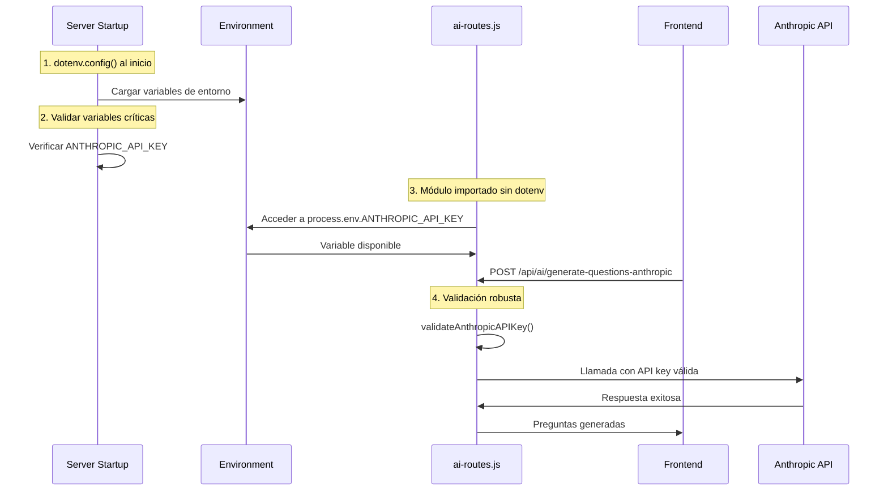

# Plan de Solución: Módulo "Generar Preguntas con IA"

## 🔍 Análisis del Problema

### Síntomas Observados
- ✅ **curl funciona**: Los comandos curl directos al servidor funcionan correctamente
- ❌ **Frontend falla**: La aplicación web muestra error "API Key inválida o expirada"
- 🔑 **API Key válida**: La clave está correctamente configurada en `.env`

### Diagnóstico del Problema

```mermaid
graph TD
    A[Frontend Request] --> B[/api/ai/generate-questions-anthropic]
    B --> C[ai-routes.js Module]
    C --> D{dotenv.config() en módulo}
    D -->|Falla| E[process.env.ANTHROPIC_API_KEY = undefined]
    E --> F[Error 401: API Key inválida]
    
    G[curl Request] --> H[Server Principal]
    H --> I[dotenv.config() en index.js]
    I --> J[Variables disponibles globalmente]
    J --> K[ai-routes.js accede a variables]
    K --> L[✅ Funciona]
    
    style F fill:#ffcccc
    style L fill:#ccffcc
```

### Causa Raíz Identificada
El problema está en la **duplicación y orden de carga** de `dotenv.config()`:

1. **En `server/index.js`** (línea 25): `dotenv.config()` se ejecuta correctamente
2. **En `server/ai-routes.js`** (línea 8): `dotenv.config()` se ejecuta nuevamente, pero puede no funcionar en módulos ES6 importados

## 🛠️ Plan de Solución Completo

### Fase 1: Corrección de Configuración de Variables de Entorno

#### 1.1 Modificar `server/index.js`
```javascript
// Mover dotenv.config() al inicio absoluto
import dotenv from 'dotenv';
dotenv.config();

// Validar variables críticas al inicio
const requiredEnvVars = ['ANTHROPIC_API_KEY', 'MONGODB_URI'];
const missingVars = requiredEnvVars.filter(varName => !process.env[varName]);

if (missingVars.length > 0) {
  console.error('❌ Variables de entorno faltantes:', missingVars);
  process.exit(1);
}

console.log('✅ Variables de entorno validadas correctamente');
```

#### 1.2 Modificar `server/ai-routes.js`
```javascript
// Remover dotenv.config() duplicado
// import dotenv from 'dotenv';
// dotenv.config(); // ← ELIMINAR ESTA LÍNEA

// Agregar validación al inicio del módulo
const ANTHROPIC_API_KEY = process.env.ANTHROPIC_API_KEY;
if (!ANTHROPIC_API_KEY) {
  console.error('❌ ANTHROPIC_API_KEY no disponible en ai-routes.js');
}
```

### Fase 2: Mejora del Manejo de Errores y Logging

#### 2.1 Función de Validación Mejorada
```javascript
function validateAnthropicAPIKey(apiKey) {
  console.log('🔍 Validando API Key...');
  console.log(`📊 API Key presente: ${!!apiKey}`);
  console.log(`📏 Longitud: ${apiKey ? apiKey.length : 0}`);
  
  if (!apiKey) {
    return { 
      valid: false, 
      error: 'ANTHROPIC_API_KEY no está configurada en las variables de entorno',
      debug: 'process.env.ANTHROPIC_API_KEY es undefined'
    };
  }
  
  if (!apiKey.startsWith('sk-ant-api03-')) {
    return { 
      valid: false, 
      error: 'Formato de ANTHROPIC_API_KEY inválido. Debe comenzar con "sk-ant-api03-"',
      debug: `Formato actual: ${apiKey.substring(0, 15)}...`
    };
  }
  
  if (apiKey.length < 50) {
    return { 
      valid: false, 
      error: 'ANTHROPIC_API_KEY parece ser demasiado corta',
      debug: `Longitud actual: ${apiKey.length}`
    };
  }
  
  return { valid: true };
}
```

#### 2.2 Logging Detallado en callAnthropicAPI
```javascript
async function callAnthropicAPI(prompt) {
  const ANTHROPIC_API_KEY = process.env.ANTHROPIC_API_KEY;
  
  console.log('🤖 === INICIO LLAMADA ANTHROPIC API ===');
  console.log(`📝 Prompt length: ${prompt.length} caracteres`);
  console.log(`🔑 API Key disponible: ${!!ANTHROPIC_API_KEY}`);
  console.log(`🔑 API Key format: ${ANTHROPIC_API_KEY ? ANTHROPIC_API_KEY.substring(0, 20) + '...' : 'undefined'}`);
  console.log(`🌍 NODE_ENV: ${process.env.NODE_ENV}`);
  console.log(`📂 Working Directory: ${process.cwd()}`);
  
  // Validar API Key
  const validation = validateAnthropicAPIKey(ANTHROPIC_API_KEY);
  if (!validation.valid) {
    console.error('❌ Validación de API Key falló:', validation);
    throw new Error(validation.error);
  }
  
  console.log('✅ API Key validada correctamente');
  
  // ... resto de la función
}
```

### Fase 3: Endpoint de Diagnóstico Mejorado

#### 3.1 Ruta de Diagnóstico Completa
```javascript
router.get('/debug', async (req, res) => {
  try {
    const diagnostics = {
      timestamp: new Date().toISOString(),
      environment: {
        NODE_ENV: process.env.NODE_ENV,
        workingDirectory: process.cwd(),
        processId: process.pid
      },
      anthropic: {
        apiKeyConfigured: !!process.env.ANTHROPIC_API_KEY,
        apiKeyLength: process.env.ANTHROPIC_API_KEY ? process.env.ANTHROPIC_API_KEY.length : 0,
        apiKeyFormat: process.env.ANTHROPIC_API_KEY ? 
          `${process.env.ANTHROPIC_API_KEY.substring(0, 15)}...` : 'No configurada',
        validation: validateAnthropicAPIKey(process.env.ANTHROPIC_API_KEY)
      },
      database: {
        connected: !!db,
        mongoUri: process.env.MONGODB_URI ? 'Configurada' : 'No configurada'
      },
      server: {
        port: process.env.PORT || 3000,
        uptime: process.uptime()
      }
    };
    
    res.json(diagnostics);
  } catch (error) {
    res.status(500).json({
      error: 'Error en diagnóstico',
      details: error.message
    });
  }
});
```

### Fase 4: Flujo de Solución Implementado



## 📋 Checklist de Implementación

### ✅ Cambios Requeridos

#### `server/index.js`
- [ ] Mover `dotenv.config()` al inicio absoluto
- [ ] Agregar validación de variables críticas
- [ ] Agregar logging de confirmación

#### `server/ai-routes.js`
- [ ] Remover `dotenv.config()` duplicado
- [ ] Mejorar función `validateAnthropicAPIKey()`
- [ ] Agregar logging detallado en `callAnthropicAPI()`
- [ ] Crear endpoint `/debug` para diagnóstico

#### Testing
- [ ] Probar curl después de cambios
- [ ] Probar frontend después de cambios
- [ ] Verificar endpoint de diagnóstico
- [ ] Probar diferentes escenarios de error

## 🎯 Resultados Esperados

### Inmediatos
1. **Funcionamiento consistente** entre curl y frontend
2. **Eliminación del error 401** en la aplicación web
3. **Logging detallado** para debugging futuro

### A Largo Plazo
1. **Configuración robusta** de variables de entorno
2. **Mejor experiencia de debugging** para desarrolladores
3. **Manejo de errores más informativo** para usuarios

## 🚀 Orden de Implementación

1. **Paso 1**: Modificar `server/index.js` para configuración centralizada
2. **Paso 2**: Limpiar `server/ai-routes.js` removiendo dotenv duplicado
3. **Paso 3**: Agregar logging y validación mejorada
4. **Paso 4**: Crear endpoint de diagnóstico
5. **Paso 5**: Testing completo

## 🔧 Comandos de Testing

```bash
# 1. Probar endpoint de diagnóstico
curl -s http://localhost:3000/api/ai/debug | jq .

# 2. Probar endpoint de test
curl -s -X POST http://localhost:3000/api/ai/test-anthropic | jq .

# 3. Probar generación de preguntas
curl -s -X POST http://localhost:3000/api/ai/generate-questions-anthropic \
  -H "Content-Type: application/json" \
  -d '{"source":{"type":"text","content":"test"},"numQuestions":1}' | jq .
```

---

**Nota**: Este plan asegura que el módulo de IA funcione de manera consistente tanto desde curl como desde el frontend, eliminando la discrepancia actual en el manejo de variables de entorno.