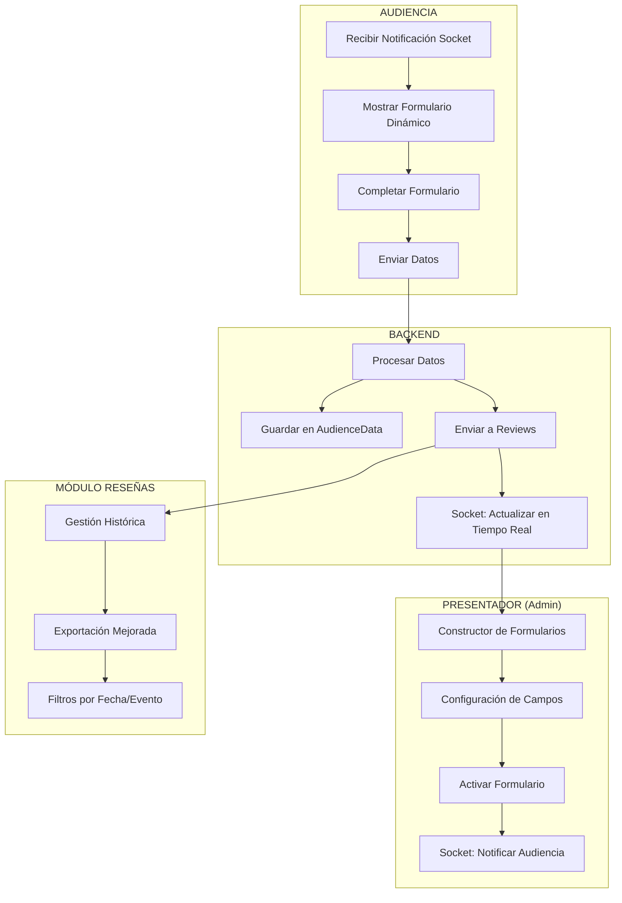
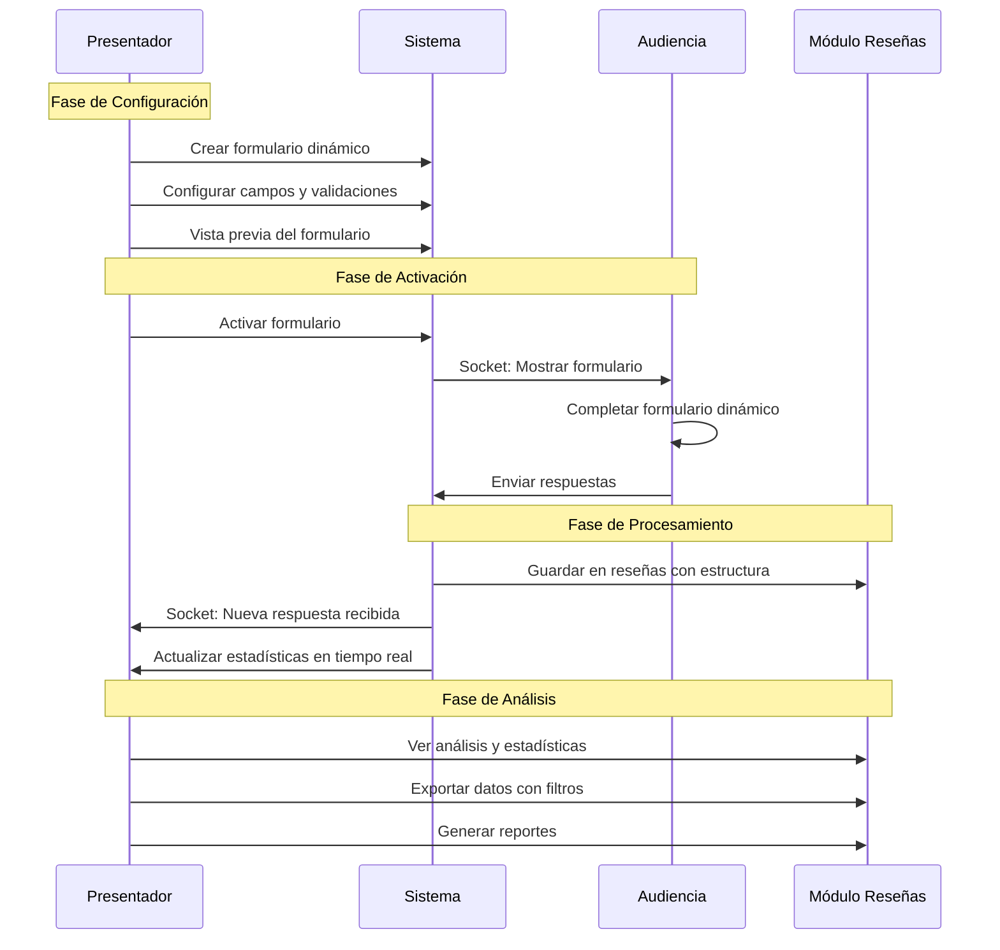

# Plan Detallado: Mejora del Módulo "Datos de la Audiencia" con Constructor de Formularios Dinámico

## Análisis de la Situación Actual

### Problemas Identificados
1. **Formulario estático**: El formulario actual solo captura nombre, email y comentarios básicos
2. **Falta de flexibilidad**: No permite al presentador personalizar qué información solicitar
3. **Desconexión entre módulos**: No hay integración directa entre "Datos de la audiencia" y "Reseñas"
4. **Socket básico**: El sistema actual no maneja formularios dinámicos en tiempo real
5. **Exportación limitada**: Solo exporta datos básicos sin análisis

### Estructura Actual
- **Frontend**: [`AudienceDataForm.tsx`](src/components/audience/AudienceDataForm.tsx) - Formulario estático
- **Backend**: [`AudienceData.js`](server/models/AudienceData.js) - Modelo simple
- **Store**: [`audienceDataStore.ts`](src/store/audienceDataStore.ts) - Socket básico
- **Admin**: [`AudienceDataTable.tsx`](src/components/admin/AudienceDataTable.tsx) - Vista tabular simple

## Arquitectura Propuesta



## Estructura de Datos Propuesta

### 1. Esquema de Formulario Dinámico
```typescript
interface FormField {
  id: string;
  type: 'text' | 'textarea' | 'stars-5' | 'stars-10' | 'number' | 'select' | 'checkbox' | 'email' | 'date';
  label: string;
  required: boolean;
  options?: string[]; // Para select y checkbox
  min?: number; // Para number y stars
  max?: number; // Para number y stars
  placeholder?: string;
  order: number;
}

interface DynamicForm {
  id: string;
  title: string;
  description?: string;
  fields: FormField[];
  eventId: string;
  createdAt: Date;
  isActive: boolean;
  createdBy: string; // ID del presentador
}
```

### 2. Esquema de Respuesta
```typescript
interface FormResponse {
  _id: string;
  formId: string;
  eventId: string;
  responses: Record<string, any>; // fieldId -> value
  submittedAt: Date;
  participantId?: string;
  participantInfo?: {
    name?: string;
    email?: string;
  };
}
```

### 3. Integración con Reviews
```typescript
interface EnhancedReview {
  _id: string;
  eventId: string;
  formId?: string; // Referencia al formulario usado
  formTitle?: string;
  structuredData?: Record<string, any>; // Datos del formulario dinámico
  // Campos existentes del modelo Review
  rating?: number;
  comment?: string;
  authorId: string;
  isAnonymous: boolean;
  createdAt: Date;
}
```

## Plan de Implementación

### Fase 1: Backend - Modelos y Rutas (Prioridad Alta)

#### 1.1 Nuevos Modelos
- **Crear `server/models/DynamicForm.js`**
  - Esquema para formularios configurables
  - Validaciones para tipos de campos
  - Índices para consultas eficientes

- **Crear `server/models/FormResponse.js`**
  - Esquema para respuestas de formularios
  - Referencia a formulario y evento
  - Validación dinámica basada en configuración

#### 1.2 Rutas del Servidor
- **Actualizar `server/audience-data-routes.js`**
  - `POST /api/audience-data/forms` - Crear formulario
  - `PUT /api/audience-data/forms/:id` - Actualizar formulario
  - `GET /api/audience-data/forms/:eventId` - Obtener formularios del evento
  - `POST /api/audience-data/forms/:id/activate` - Activar formulario
  - `POST /api/audience-data/forms/:id/deactivate` - Desactivar formulario
  - `POST /api/audience-data/responses` - Enviar respuesta
  - `GET /api/audience-data/responses/:formId` - Obtener respuestas

#### 1.3 Socket Dedicado
- **Implementar eventos específicos**:
  - `audienceForm:activated` - Formulario activado
  - `audienceForm:deactivated` - Formulario desactivado
  - `audienceForm:newResponse` - Nueva respuesta recibida
  - `audienceForm:configUpdated` - Configuración actualizada
  - `audienceForm:statusUpdate` - Actualización de estado

### Fase 2: Frontend Admin - Constructor de Formularios (Prioridad Alta)

#### 2.1 Componentes Principales
- **Crear `src/components/admin/FormBuilder.tsx`**
  - Constructor visual drag-and-drop
  - Panel de herramientas con tipos de campos
  - Vista previa en tiempo real
  - Configuración de propiedades de campos

- **Crear `src/components/admin/FieldEditor.tsx`**
  - Editor de propiedades individuales
  - Validaciones específicas por tipo
  - Preview del campo en tiempo real

- **Crear `src/components/admin/FormPreview.tsx`**
  - Vista previa exacta del formulario
  - Simulación de interacciones
  - Validación visual

#### 2.2 Tipos de Campos Soportados
1. **Texto corto** (`text`)
   - Validación de longitud
   - Placeholder personalizable
   - Requerido/opcional

2. **Texto largo** (`textarea`)
   - Límite de caracteres
   - Redimensionable
   - Contador de caracteres

3. **Estrellas 1-5** (`stars-5`)
   - Iconos personalizables
   - Valores intermedios opcionales
   - Etiquetas para cada nivel

4. **Estrellas 1-10** (`stars-10`)
   - Escala extendida
   - Visualización compacta
   - Tooltips informativos

5. **Escala numérica** (`number`)
   - Rango personalizable
   - Incrementos específicos
   - Validación de límites

6. **Opción múltiple** (`select`)
   - Lista desplegable
   - Opciones configurables
   - Valor por defecto

7. **Casillas de verificación** (`checkbox`)
   - Múltiples selecciones
   - Límite de selecciones
   - Agrupación visual

8. **Email** (`email`)
   - Validación automática
   - Formato estándar
   - Verificación de dominio opcional

9. **Fecha** (`date`)
   - Selector de calendario
   - Rango de fechas válidas
   - Formato localizado

#### 2.3 Actualización de Componentes Existentes
- **Modificar `src/components/admin/AudienceDataTable.tsx`**
  - Agregar botón "Crear Formulario"
  - Lista de formularios activos
  - Estadísticas de respuestas en tiempo real
  - Acceso rápido a análisis

### Fase 3: Frontend Audiencia - Formulario Dinámico (Prioridad Alta)

#### 3.1 Renderizador Principal
- **Refactorizar `src/components/audience/AudienceDataForm.tsx`**
  - Renderizado dinámico basado en configuración
  - Validación dinámica
  - Manejo de estado complejo
  - Envío optimizado

#### 3.2 Componentes de Campo Específicos
- **Crear `src/components/audience/fields/StarRatingField.tsx`**
  - Componente reutilizable para ambas escalas
  - Animaciones suaves
  - Accesibilidad completa

- **Crear `src/components/audience/fields/NumberScaleField.tsx`**
  - Slider visual
  - Input numérico alternativo
  - Validación en tiempo real

- **Crear `src/components/audience/fields/SelectField.tsx`**
  - Dropdown estilizado
  - Búsqueda en opciones largas
  - Selección múltiple opcional

- **Crear `src/components/audience/fields/CheckboxField.tsx`**
  - Grupo de checkboxes
  - Validación de límites
  - Diseño responsive

#### 3.3 Validación y UX
- **Crear `src/utils/formValidation.ts`**
  - Validadores dinámicos por tipo
  - Mensajes de error personalizables
  - Validación en tiempo real y al envío

- **Mejorar experiencia móvil**
  - Campos optimizados para touch
  - Teclados específicos por tipo
  - Navegación fluida entre campos

### Fase 4: Integración con Módulo Reseñas (Prioridad Media)

#### 4.1 Actualización del Modelo
- **Modificar `server/models/Review.js`**
  - Agregar campos para formularios dinámicos
  - Mantener compatibilidad con datos existentes
  - Índices para consultas eficientes

#### 4.2 Vista Unificada
- **Actualizar `src/components/admin/ReviewView.tsx`**
  - Mostrar respuestas estructuradas
  - Filtros por tipo de formulario
  - Agrupación por evento y fecha
  - Vista detallada de respuestas individuales

#### 4.3 Exportación Mejorada
- **Mejorar funcionalidad de exportación**
  - Soporte para campos dinámicos en CSV/Excel
  - Exportación de análisis estadísticos
  - Filtros avanzados para exportación
  - Formatos múltiples (PDF, Word, Excel)

### Fase 5: Socket y Tiempo Real (Prioridad Media)

#### 5.1 Store Actualizado
- **Actualizar `src/store/audienceDataStore.ts`**
  - Manejo de formularios dinámicos
  - Estado de formularios activos
  - Cache de configuraciones
  - Sincronización en tiempo real

#### 5.2 Eventos de Socket
```typescript
// Eventos del presentador
socket.emit('audienceForm:create', formConfig);
socket.emit('audienceForm:activate', formId);
socket.emit('audienceForm:deactivate', formId);

// Eventos de la audiencia
socket.emit('audienceForm:response', responseData);
socket.emit('audienceForm:join', eventId);

// Eventos del servidor
socket.on('audienceForm:activated', (formConfig) => {});
socket.on('audienceForm:deactivated', () => {});
socket.on('audienceForm:newResponse', (response) => {});
socket.on('audienceForm:statsUpdate', (stats) => {});
```

### Fase 6: Análisis y Estadísticas (Prioridad Baja)

#### 6.1 Dashboard de Análisis
- **Crear `src/components/admin/ResponseAnalytics.tsx`**
  - Gráficos para datos numéricos
  - Distribución de calificaciones
  - Análisis de texto (nube de palabras)
  - Métricas de participación

#### 6.2 Reportes Automáticos
- **Generación de reportes**
  - Resúmenes ejecutivos
  - Comparativas entre eventos
  - Tendencias temporales
  - Exportación de insights

## Flujo de Usuario Mejorado



## Consideraciones Técnicas

### 1. Performance
- **Lazy loading** de componentes de formulario
- **Virtualización** para listas largas de respuestas
- **Debouncing** en validaciones en tiempo real
- **Caching** de configuraciones de formularios

### 2. Validación
- **Cliente y servidor** para todos los tipos de campo
- **Sanitización** de datos de entrada
- **Validación de esquemas** dinámicos
- **Manejo de errores** robusto

### 3. Accesibilidad
- **ARIA labels** para todos los campos
- **Navegación por teclado** completa
- **Lectores de pantalla** compatibles
- **Contraste** adecuado en todos los elementos

### 4. Responsive Design
- **Mobile-first** approach
- **Touch-friendly** interfaces
- **Adaptive layouts** para diferentes pantallas
- **Gestos táctiles** optimizados

### 5. Internacionalización
- **Soporte multiidioma** para etiquetas
- **Formatos localizados** para fechas y números
- **Direccionalidad** de texto (RTL/LTR)
- **Validaciones** específicas por región

### 6. Seguridad
- **Validación de entrada** estricta
- **Sanitización** de datos HTML
- **Rate limiting** para envíos
- **Autenticación** de presentadores

## Archivos a Crear/Modificar

### Nuevos Archivos Backend
- `server/models/DynamicForm.js`
- `server/models/FormResponse.js`
- `server/routes/form-builder-routes.js`

### Nuevos Archivos Frontend Admin
- `src/components/admin/FormBuilder.tsx`
- `src/components/admin/FieldEditor.tsx`
- `src/components/admin/FormPreview.tsx`
- `src/components/admin/ResponseAnalytics.tsx`
- `src/components/admin/FormTemplates.tsx`

### Nuevos Archivos Frontend Audiencia
- `src/components/audience/DynamicFormRenderer.tsx`
- `src/components/audience/fields/StarRatingField.tsx`
- `src/components/audience/fields/NumberScaleField.tsx`
- `src/components/audience/fields/SelectField.tsx`
- `src/components/audience/fields/CheckboxField.tsx`

### Archivos Utilitarios
- `src/types/formTypes.ts`
- `src/utils/formValidation.ts`
- `src/utils/formUtils.ts`
- `src/hooks/useFormBuilder.ts`
- `src/hooks/useDynamicForm.ts`

### Archivos a Modificar
- `src/components/audience/AudienceDataForm.tsx` (refactorización completa)
- `src/components/admin/AudienceDataTable.tsx` (agregar gestión de formularios)
- `src/components/admin/ReviewView.tsx` (integración con formularios dinámicos)
- `src/store/audienceDataStore.ts` (socket y estado mejorado)
- `src/store/reviewStore.ts` (integración con formularios)
- `server/audience-data-routes.js` (rutas para formularios dinámicos)
- `server/review-routes.js` (integración con respuestas de formularios)

## Cronograma Estimado

### Semana 1-2: Backend Foundation
- Modelos de base de datos
- Rutas básicas del API
- Socket events básicos

### Semana 3-4: Constructor de Formularios (Admin)
- Interfaz de construcción
- Editor de campos
- Vista previa

### Semana 5-6: Formulario Dinámico (Audiencia)
- Renderizador principal
- Componentes de campos
- Validación dinámica

### Semana 7-8: Integración y Refinamiento
- Integración con módulo Reseñas
- Socket en tiempo real
- Testing y optimización

### Semana 9-10: Análisis y Exportación
- Dashboard de análisis
- Exportación mejorada
- Documentación final

## Métricas de Éxito

1. **Funcionalidad**
   - ✅ Presentador puede crear formularios dinámicos
   - ✅ Audiencia recibe formularios en tiempo real
   - ✅ Respuestas se guardan correctamente
   - ✅ Integración con módulo Reseñas funciona

2. **Performance**
   - ⏱️ Tiempo de carga < 2 segundos
   - ⏱️ Respuesta de socket < 100ms
   - ⏱️ Formularios con 50+ campos funcionan fluido

3. **Usabilidad**
   - 📱 Funciona en dispositivos móviles
   - ♿ Cumple estándares de accesibilidad
   - 🌍 Soporte multiidioma completo

4. **Escalabilidad**
   - 👥 Soporta 1000+ respuestas simultáneas
   - 📊 Exportación de datasets grandes
   - 🔄 Sincronización en tiempo real estable

## Conclusión

Este plan transforma el módulo "Datos de la audiencia" de un formulario estático a una plataforma completa de captura de feedback dinámico, manteniendo la integración híbrida con el módulo "Reseñas" para gestión histórica y exportación. La implementación por fases permite un desarrollo incremental y testing continuo.